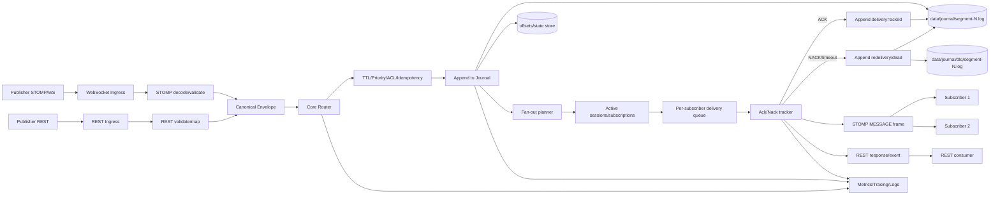

### Технологии

- Python 3.11 / 3.12  
- FastAPI + uvicorn 
- STOMP 1.2 over WebSocket
- персистентность через журнал на диске 
- prometheus-fastapi-instrumentator  
- pydantic v2, structlog, tenacity 

### Структура проекта 

```
project/
├── app/
│   ├── core/             # логика брокера 
│   ├── persistence/      # запись/чтение журнала, индекс смещений, отбраковка в отдельных файлах
│   ├── protocol/         # stomp парсер + websocket handlers
│   ├── api/              # rest endpoints
│   ├── metrics/          # prometheus
│   └── main.py
├── sdk/                  # клиентская библиотека 
├── data/journal/         # сегменты журнала (создаётся при работе)
├── tests/
├── docker-compose.yml
├── Dockerfile
└── docs/
    └── architecture.md
```

---

### Архитектура 


Слои остаются теми же, но детализация маршрута сообщения расширена: **presentation** → **protocol** → **core** → **persistence** → **delivery lifecycle** → ответ клиенту.

#### 1) Точки входа и первичная нормализация

- **WebSocket `/ws` (STOMP)**: сервер принимает фреймы `CONNECT`, `SUBSCRIBE`, `SEND`, `ACK`, `NACK`, `DISCONNECT`; на этом этапе хранится только состояние сокета и сессии в памяти процесса.
- **REST API**: запросы публикации/чтения/состояния проходят валидацию pydantic; до подтверждения записи на диск живут в памяти воркера.
- **Нормализация**: любой вход приводится к единому внутреннему `Canonical Envelope` со стабильными полями: `message_id`, `destination`, `headers`, `body`, `priority`, `ttl`, `published_at`, `delivery_policy`.

#### 2) Protocol-слой

- **STOMP decode/encode**: парсер проверяет обязательные заголовки, корректность `destination`, кодировку тела, `content-length`, режим подтверждений (`ack: auto|client|client-individual`).
- **REST mapping**: REST DTO преобразуется в те же внутренние поля, что и STOMP `SEND`.
- **Ошибки протокола**: некорректные сообщения завершаются ошибкой уровня presentation/protocol, в core не попадают.

#### 3) Core-слой: маршрутизация и политики

- **Router** определяет топик и набор подписчиков по таблице подписок в памяти.
- **TTL** вычисляет `expires_at`; просроченные сообщения не отдаются подписчикам и переводятся в terminal-state.
- **Priority** определяет порядок в очередях доставки (меньшее число = выше приоритет).
- **Idempotency** по `message_id` и/или `correlation-id` предотвращает дубли при повторной отправке клиента.

#### 4) Persistence-слой: что и где хранится

- **Append-only журнал** (`data/journal/segment-*.log`) — источник истины для входящих сообщений и переходов состояний.
- Каждое изменение фиксируется отдельной записью события:
  - `message_published`
  - `delivery_scheduled`
  - `delivery_acked`
  - `delivery_nacked`
  - `delivery_redelivered`
  - `delivery_dead_lettered`
  - `message_expired`
- **Offsets/state store** (`offsets.json` или эквивалент) хранит позицию чтения по топикам/консьюмерам для восстановления после рестарта.
- **DLQ** (`data/journal/dlq/segment-*.log`) хранит сообщения, исчерпавшие лимит redelivery или отклонённые политиками.

#### 5) Полный путь publish-сообщения

1. Клиент отправляет `SEND` (STOMP) или `POST` (REST).
2. Presentation принимает запрос, protocol выполняет разбор/валидацию.
3. Формируется `Canonical Envelope` и передаётся в core.
4. Core применяет TTL/priority/idempotency и строит план доставки.
5. Persistence добавляет `message_published` в append-only журнал и возвращает offset записи.
6. Core получает подтверждение записи и только после этого подтверждает приём publisher-у.
7. Для каждого подписчика создаётся задача доставки в его логической очереди.
8. Сообщение выдаётся подписчику в STOMP `MESSAGE` или в REST-поток/ответ в зависимости от канала.
9. Система ожидает `ACK/NACK` по политике подписки.
10. При `ACK` пишется `delivery_acked` в журнал, задача закрывается.
11. При `NACK`/timeout пишется `delivery_nacked` и планируется `delivery_redelivered`.
12. После превышения лимита попыток пишется `delivery_dead_lettered`, копия уходит в DLQ.

#### 6) Полный путь subscribe-сообщения

1. Клиент делает `SUBSCRIBE` (STOMP) или регистрирует подписку через REST.
2. В памяти создаётся session binding: `session_id -> destination/filter/ack_mode`.
3. При наличии persisted истории определяется стартовая позиция из offsets.
4. На доставку попадают только релевантные и неистёкшие сообщения.
5. После успешных ACK сдвигаются consumer offsets и фиксируются на диске.

#### 7) Хранение по этапам жизненного цикла

- **До записи в журнал**: только RAM (буфер запроса/фрейма).
- **После `message_published`**: durable-состояние в `segment-*.log`.
- **Во время fan-out**: RAM-структуры маршрутизации + ссылки на durable offset.
- **Во время ожидания ACK**: RAM таймеры/таблицы доставки + durable события о выдаче/повторе.
- **Terminal state**:
  - `acked` — подтверждённое событие в основном журнале;
  - `expired` — событие истечения TTL в основном журнале;
  - `dead_lettered` — событие в основном журнале + запись в DLQ.

#### 8) Восстановление после рестарта

- При старте broker перечитывает сегменты журнала последовательно и восстанавливает:
  - карту подписок/топиков (если она персистится событиями),
  - состояние сообщений (pending/acked/dead/expired),
  - последние offsets для подписчиков.
- Неподтверждённые доставки возвращаются в очередь redelivery.
- Согласованность обеспечивается правилом: `сначала append события, потом внешнее подтверждение`.

#### 9) Наблюдаемость и контроль

- **Метрики**: входящий rate, глубина очередей, latency publish→ack, redelivery count, размер DLQ.
- **Логи**: корреляция по `message_id`/`correlation-id`, чтобы проследить полный путь сообщения.
- **Технический endpoint** `/metrics` — экспорт состояния для Prometheus/алертов.

---

### Как выглядят сообщения 

```json
{
  "id": "uuid4 строка",
  "destination": "/topic/news.sport",
  "body": "строка или base64 если бинарный",
  "headers": {
    "content-type": "application/json",
    "correlation-id": "abc123"
  },
  "priority": 3,          // 0 = самый важный, 9 = низкий
  "ttl_seconds": 3600,    // или null = никогда не умирать
  "published_at": "2026-03-22T14:35:12Z",
  "redelivery_count": 0
}
```

### Журнал на диске

Одна запись журнала соответствует событию или сообщению в сериализованном виде. Имя сегмента может включать дату или монотонный номер; при росте файла открывается новый сегмент. Для позиционирования подписчик сохраняет offset по топику: отдельный небольшой файл или раздел в том же журнале. Состояние доставки (`pending` / `acked` / `dead`) отражается новыми записями в журнале (event sourcing).

Пример имён файлов:

```
data/journal/
  segment-00001.log
  segment-00002.log
  offsets.json
  dlq/
    segment-00001.log
```

---

### План разработки 

### Этап 2 — прототип

**Цель**  
Запустить брокер

- объявление и подписка на `/topic/...`
- publisher отправляет сообщение в топик
- несколько подписчиков получают одно и то же сообщение
- хранение в памяти
- минимальный STOMP или rest и sdk

**Результат**  
Рабочий прототип 

---

### Этап 3 — персистентность

**Цель**  
Не терять историю и позицию чтения после рестарта.

- append-only журнал для событий топиков
- после рестарта подписчик продолжает с сохранённого offset, если это заложено в модель
- sdk: переподключение при обрыве

**Результат**  
Топики с диском и восстановлением

---

### Этап 4 — доп. функции и полировка

**Цель**  
Приоритеты, TTL, DLQ, Prometheus, REST для состояния, тесты

**Результат**  
Готовый продукт

